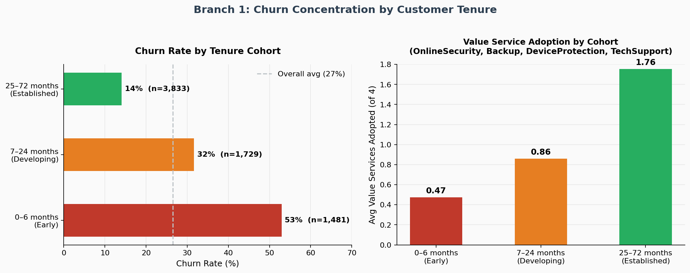
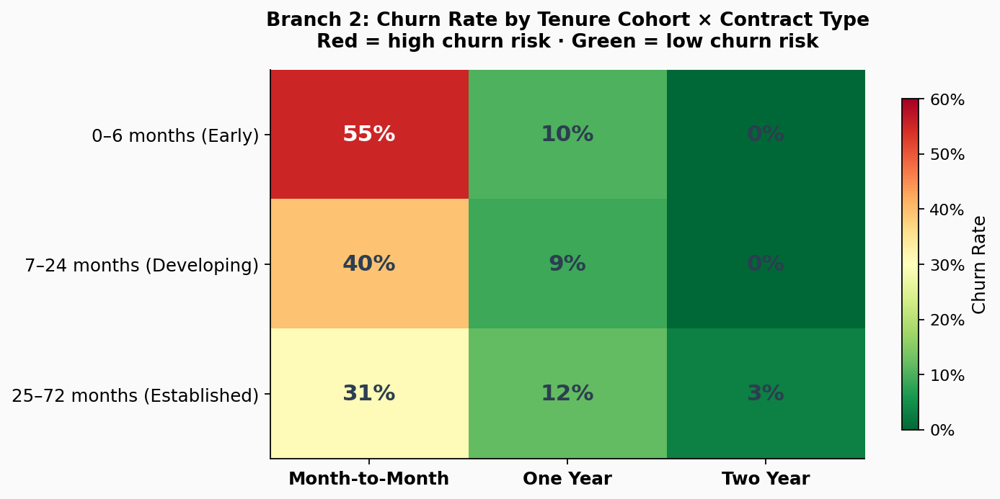
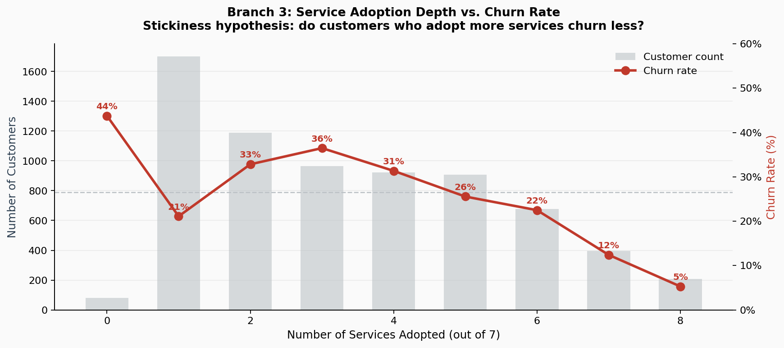
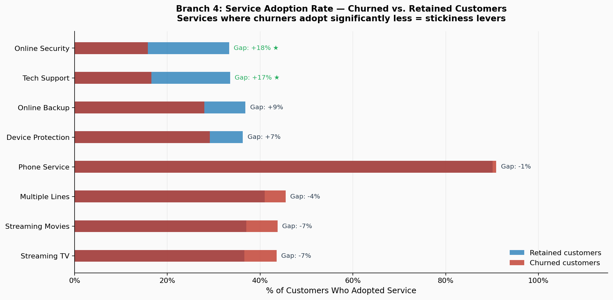
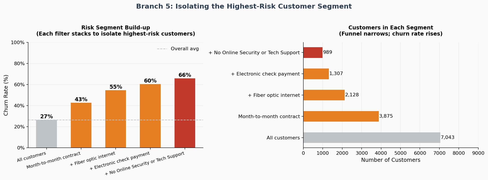
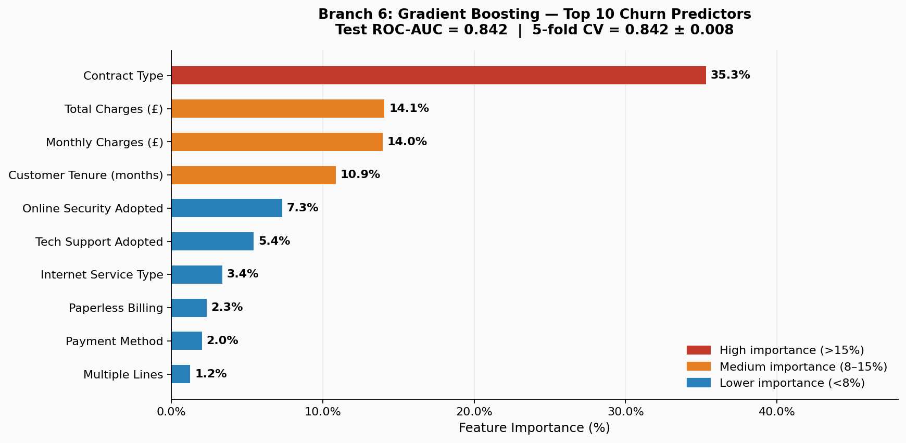

# Customer Churn Analysis — Telecom Subscription Business

**Sector:** Telecom · B2C &nbsp;|&nbsp; **Duration:** ~10 days equivalent &nbsp;|&nbsp; **Data:** IBM Telco Customer Churn (real, public) &nbsp;|&nbsp; **Model:** Gradient Boosting · ROC-AUC 0.842

---

## Dataset

**IBM Telco Customer Churn** — publicly released by IBM as a Cognos Analytics sample dataset.  
7,043 customers · 21 variables · Home phone and internet services, California.  
Source: [github.com/IBM/telco-customer-churn-on-icp4d](https://github.com/IBM/telco-customer-churn-on-icp4d)

This is real customer data, not synthetically generated. All analysis runs directly on the downloaded CSV.

---

## The Brief

A telecom subscription business is experiencing elevated churn. The leadership team wants to understand *where* churn is concentrated, *what* structural factors drive it, and *which* customer segments should be prioritised for retention intervention.

This is a diagnostic and prioritisation engagement — not an implementation project. The output is a set of analytically grounded hypotheses and recommended tests, not a measured outcome.

---

## Analytical Framework

Structured using a McKinsey-style issue tree: one root question, six analytical branches, each independently testable.

**Root question:** Where is churn concentrated and what structural factors drive it?

| Branch | Question | Method |
|---|---|---|
| 1 — Tenure Cohort | Is churn a new-customer problem or evenly distributed? | Cohort segmentation |
| 2 — Contract Type | Does commitment level predict churn? | Cross-tabulation + chi-square |
| 3 — Service Depth | Do customers with more services churn less? | Stickiness hypothesis testing |
| 4 — Service Differentiators | Which specific services distinguish churners from retained? | Adoption rate comparison + chi-square |
| 5 — Risk Segment | Can we isolate a highest-risk cluster? | Progressive filter isolation |
| 6 — Predictive Model | Which variables have greatest predictive power? | Gradient Boosting (ROC-AUC 0.842) |

---

## Key Findings

### Finding 1 — Churn is front-loaded
Early customers (0–6 months) churn at **52.9%** — nearly 4x the rate of established customers (14.0%). The problem is concentrated in the onboarding window, not evenly distributed across the lifecycle.

### Finding 2 — Contract type is the single strongest structural lever
Month-to-month: **42.7% churn.** One-year: **11.3%.** Two-year: **2.8%.** This is a structural difference, not a marginal one. The predictive model confirms contract type as the #1 churn predictor at 35% feature importance — well above all other variables.

### Finding 3 — Service adoption depth is a stickiness mechanism
Customers who adopted zero value services (OnlineSecurity, TechSupport, OnlineBackup, DeviceProtection) churn at **43.8%.** Customers who adopted all four: **5.3%.** Each value service added reduces churn meaningfully — they create switching cost and perceived indispensability.

### Finding 4 — Two services stand out as the highest-impact differentiators
- **Online Security:** churned customers adopt at 15.8% vs 33.3% for retained (+17pp gap, statistically significant)
- **Tech Support:** churned customers adopt at 16.6% vs 33.5% for retained (+17pp gap, statistically significant)

These are not entertainment add-ons — they're services that embed the customer into a support relationship and create genuine workflow dependency.

### Finding 5 — Highest-risk segment isolated
**989 customers** share all four highest-risk characteristics: month-to-month contract + fiber optic internet + electronic check payment + zero value services. This segment churns at **65.8%** against an overall rate of 26.5%. Average monthly spend: £85.23. This is the priority intervention target.

---

## Recommendations (Hypotheses to Test)

These are analytically grounded recommendations — they have not been implemented. Each is structured as a testable hypothesis with a proposed A/B test design.

**1. Contract upgrade offer at Day 30 and Day 90** for month-to-month customers — particularly those in the 0–6 month cohort. Test: 50/50 split, measure 90-day churn vs control.

**2. Free 3-month trial of Online Security or Tech Support at onboarding** for all new customers. Test: measure Day-90 activation rate and 6-month churn rate vs no-trial control.

**3. Autopay migration campaign for electronic check customers** — offer a 5% discount for switching to bank transfer or credit card autopay. Test: outbound campaign to 50% of segment, measure 90-day churn change.

**4. Proactive customer success outreach to highest-risk segment** (989 customers) at Month 1 and Month 3. Test: pilot with 50%, measure 6-month retention vs no-touch control.

---

## The Hardest Question

> *"You haven't measured whether any of this works. How is this useful?"*

It's useful because the alternative is acting without structure. Before this analysis, an intervention programme would target all customers equally — which is expensive and unfocused. After it, you have a prioritised list: which segment to reach first, which lever to pull (contract, not price), and which services to bundle (Security and TechSupport, not Streaming). You've also designed the test before you deploy it, which means you'll actually be able to measure the result.

The analysis doesn't implement change. It eliminates the excuse for acting without evidence.

---

## Model Notes

- **Algorithm:** Gradient Boosting Classifier (200 estimators, depth 4, learning rate 0.05)
- **Split:** 75% train / 25% test, stratified on churn label
- **ROC-AUC:** 0.842 (test) | 0.842 ± 0.008 (5-fold cross-validation)
- **Precision/Recall (churn class):** 0.67 / 0.48 — conservative flagging, acceptable for prioritisation use
- The model is stable (low CV variance) and not overfitting. It is a prioritisation tool, not a deterministic churn predictor.

---

## Honest Limitations

- **Single time-period snapshot** — no longitudinal view of individual customer behaviour over time
- **No churn reason data** — we know who churned but not why they stated they were leaving
- **Correlation, not causation** — all associations are observational. Controlled A/B testing is required before attributing causal effect to any intervention
- **External factors uncontrolled** — competitor pricing, market events, and product changes during the period are not captured

---

## Files

| File | Description |
|---|---|
| `analysis.py` | Full analytical pipeline: data cleaning, 6-branch issue tree, 6 charts, model training |
| `build_excel.py` | Builds the 7-sheet professional Excel workbook |
| `data/Telco-Customer-Churn.csv` | Real IBM Telco dataset (downloaded from IBM GitHub) |
| `outputs/Churn_Analysis_Telecom_VaishnaviBhor.xlsx` | 7-sheet workbook: Cover → Cohort → Contract → Service → Risk Segment → Model → Recommendations |
| `charts/` | 6 charts (PNG) |

---

## Charts

### Branch 1 — Churn by Tenure Cohort

### Branch 2 — Contract × Cohort Heatmap

### Branch 3 — Service Adoption Depth vs Churn Rate

### Branch 4 — Service Differentiators

### Branch 5 — Risk Segment Build-up

### Branch 6 — Predictive Model Feature Importance

---

## Tools

Python (Pandas, Scikit-learn, Matplotlib, Seaborn, SciPy) · Excel (openpyxl) · IBM Telco public dataset

---

## About

**Vaishnavi Bhor** — Business & Data Analyst  
MSc Business Analytics, University of Manchester  
[linkedin.com/in/vaishnavi-bhor-business-analyst](https://linkedin.com/in/vaishnavi-bhor-business-analyst) · vbhor207@gmail.com · [vbho.github.io/portfolio](https://vbho.github.io/portfolio)
